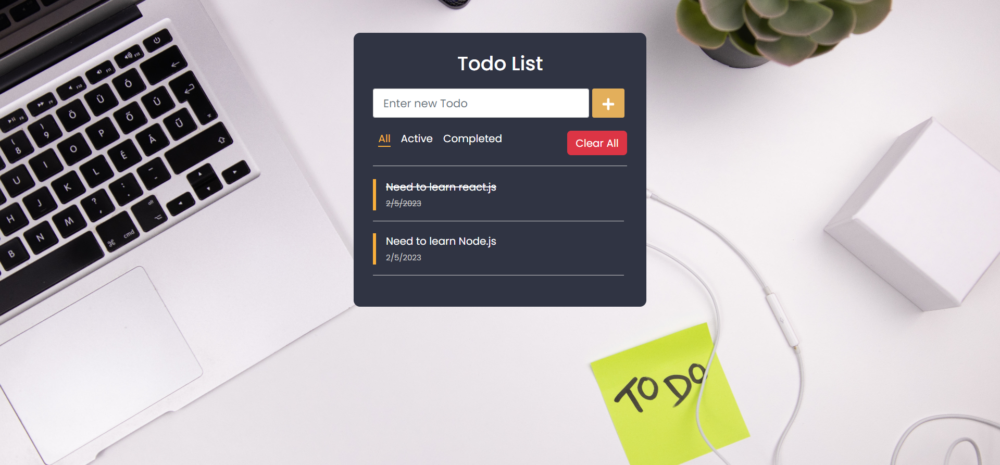

<p align="center">
<br>
<a href="https://todo-binay7587.vercel.app" target="_blank">TODO List App</a>
</p>

# Todo List with Create React App

A simple todo list app created with React.js

Check the hosted demo site. https://todo-binay7587.vercel.app


## Setup Instructions

First clone this repository.
```bash
$ git clone https://github.com/Binay7587/todo-list
```

Install dependencies. Make sure you have [`nodejs`](https://nodejs.org/en/) & [`npm`](https://www.npmjs.com/) installed in your system.
```bash
$ npm install # or yarn
```

Run
```bash
$ npm start # or yarn start
```

<!-- FURTHER ENHANCEMENT -->
## Further Enhancement
Some of the future enhancement for the application are listed below.
1. Authentication.
2. Add an option to edit the todo.
3. Save todo in database. 

<!-- BUILT WITH -->
## Built With

* [React.js](https://reactjs.org/)

<!-- CONTACT -->
## Contact

Binaya Karki - [@binay7587](https://www.linkedin.com/in/binay7587) - me@binayakarki.com.np

Repository Link: [https://github.com/Binay7587/todo-list](https://github.com/Binay7587/todo-list)

<p align="right">(<a href="#top">back to top</a>)</p>

<!-- LICENSE -->
## License

Distributed under the MIT License. See [https://github.com/Binay7587/todo-list/tree/master/LICENSE](https://github.com/Binay7587/todo-list/tree/master/LICENSE) for more information.

<p align="right">(<a href="#top">back to top</a>)</p>